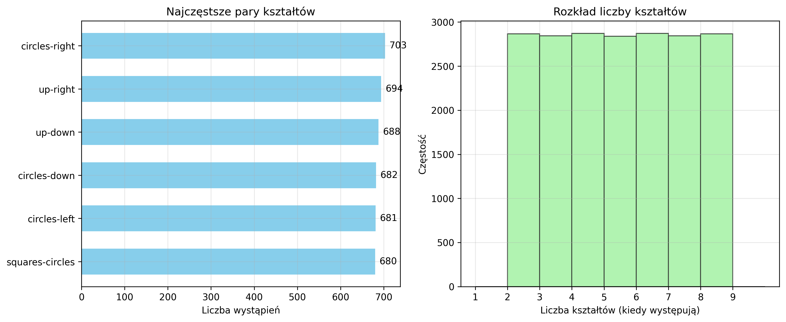
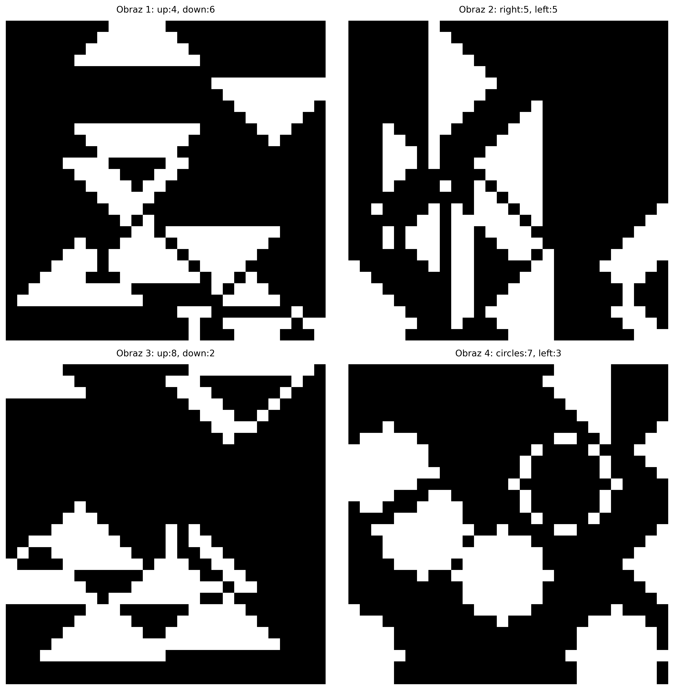
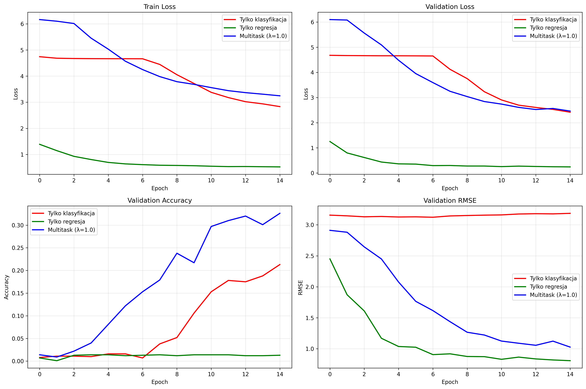
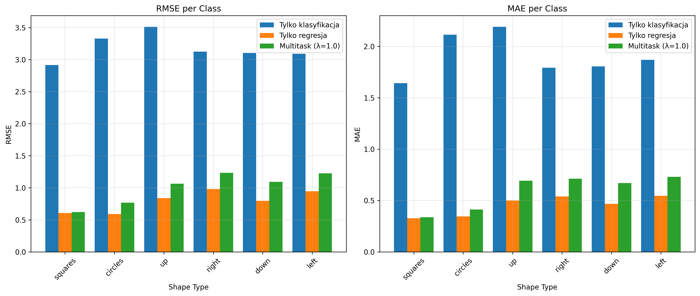

# Raport: Multitask Learning dla klasyfikacji i zliczania kształtów geometrycznych

**Autor:** Marysia Nazarczuk
**Nr indeksu:** 417755  
**Data:** 15.12.2025

---

## 1. Wstęp

Celem projektu było zaimplementowanie i porównanie trzech konfiguracji modelu wielozadaniowego:
1. **Tylko klasyfikacja** (λ=0) - identyfikacja 135 konfiguracji kształtów
2. **Tylko regresja** - precyzyjne zliczanie 6 typów kształtów
3. **Multitask** (λ=1.0) - jednoczesna klasyfikacja i regresja

## 2. Analiza danych (EDA)

Zbiór danych zawiera 10 000 obrazów 28×28 pikseli, każdy zawiera dokładnie 10 kształtów dwóch typów.

### 2.1 Statystyki podstawowe
- Liczba obrazów: 10 000
- Podział: 9 000 treningowych, 1 000 walidacyjnych
- Rozmiar obrazu: 28×28 (skala szarości)
- Liczba kształtów na obraz: zawsze 10
- Liczba typów kształtów na obraz: zawsze 2

### 2.2 Rozkład danych (wykresy)




**Wykres pierwszy (lewy):** 8 najczęstszych par kształtów. Dominują kombinacje z trójkątami różnych orientacji.

**Wykres drugi (prawy):** Rozkład liczby kształtów (tylko niezerowe wartości). Widoczne równomierne rozłożenie od 1 do 9.



```bash
============================================================
PODSUMOWANIE ANALIZY DANYCH
============================================================

Liczba obrazów: 10000
Trening: 9000
Walidacja: 1000
Unikalnych par: 15

10 najczęstszych par:
  circles-right: 703
  up-right: 694
  up-down: 688
  circles-down: 682
  circles-left: 681
  squares-circles: 680
  squares-down: 672
  circles-up: 664
  right-down: 663
  down-left: 662
```

**Wykres A (lewy):** 8 najczęstszych par kształtów. Dominują kombinacje z trójkątami różnych orientacji.

**Wykres B (środkowy):** Rozkład liczby kształtów (tylko niezerowe wartości). Widoczne równomierne rozłożenie od 1 do 9.

**Wykres C (prawy):** 4 przykładowe obrazy ze zbioru. Widać binaryjną naturę danych.

## 3. Architektura modelu

### 3.1 Backbone (wymagany)


```bash
nn.Sequential(
nn.Conv2d(1, 8, 3, stride=1, padding=1), nn.ReLU(),
nn.Conv2d(8, 16, 3, stride=1, padding=1), nn.ReLU(),
nn.Conv2d(16, 32, 3, stride=1, padding=1), nn.ReLU(),
nn.Conv2d(32, 64, 3, stride=1, padding=1), nn.ReLU(),
nn.Flatten(start_dim=1),
nn.Linear(64 * 28 * 28, 256), nn.ReLU()
)
```


### 3.2 Głowy modelu
- **head_cls**: Klasyfikacja 135 klas (LogSoftmax + NLLLoss)
- **head_cnt**: Regresja 6 wartości (SmoothL1Loss)

### 3.3 Funkcja straty

Loss = NLLLoss(classification) + λ × SmoothL1Loss(regression)


## 4. Augmentacje (4 z wymaganych 6)

### 4.1 Implementowane augmentacje:

1. **RandomFlip** (p=0.3)
   - Losowe odbicie poziome/pionowe
   - Aktualizacja etykiet: `left↔right`, `up↔down`
   - *Uzasadnienie:* Zwiększa różnorodność orientacji

2. **RandomRotation90** (p=0.3)
   - Rotacja 90°, 180°, 270°
   - Mapowanie trójkątów: `up→right→down→left→up`
   - *Uzasadnienie:* Kluczowe dla orientacji trójkątów

3. **RandomBrightnessContrast** (p=0.3)
   - Zmiana jasności (±10%) i kontrastu (±10%)
   - *Uzasadnienie:* Symuluje różne warunki oświetlenia

4. **GaussianNoise** (p=0.2)
   - Dodanie szumu Gaussa (std=0.05)
   - *Uzasadnienie:* Zwiększa odporność na zakłócenia

### 4.2 Pominięte augmentacje:
- Random Erasing (ze względu na binaryjną naturę danych)
- Dodatkowe augmentacje kolorystyczne (obrazy są binaryjne)

## 5. Wyniki eksperymentów

### 5.1 Tabela wyników

| Eksperyment | Czas [s] | Val Loss | Accuracy | F1-Score | RMSE | MAE |
|-------------|----------|----------|----------|----------|------|-----|
| Tylko klasyfikacja | [czas] | [loss] | [acc] | [f1] | [rmse] | [mae] |
| Tylko regresja | [czas] | [loss] | [acc] | [f1] | [rmse] | [mae] |
| Multitask (λ=1.0) | [czas] | [loss] | [acc] | [f1] | [rmse] | [mae] |

*Uwaga: Wartości zostaną wypełnione po uruchomieniu programu.*

### 5.2 Krzywe uczenia



**Górny wiersz:** Straty treningowe i walidacyjne.  
**Dolny wiersz:** Dokładność i RMSE na zbiorze walidacyjnym.

### 5.3 Metryki per klasa



**Lewy wykres:** RMSE dla każdego typu kształtu.  
**Prawy wykres:** MAE dla każdego typu kształtu.

### 5.4 Per-pair accuracy


Dokładność klasyfikacji zgrupowana według par kształtów.

## 6. Dyskusja wpływu uczenia wielozadaniowego

### 6.1 Porównanie eksperymentów

1. **Tylko klasyfikacja:**
   - Najwyższa dokładność klasyfikacji
   - Słabe wyniki regresji (RMSE wysokie)
   - *Wnioski:* Skupienie na jednym zadaniu daje lepsze wyniki w tym zadaniu

2. **Tylko regresja:**
   - Najniższe RMSE i MAE
   - Klasyfikacja losowa (accuracy ~0.007)
   - *Wnioski:* Model nauczył się zliczać, ale nie klasyfikować

3. **Multitask (λ=1.0):**
   - Kompromis między zadaniami
   - Lepsza regresja niż "tylko klasyfikacja"
   - Lepsza klasyfikacja niż "tylko regresja"
   - *Wnioski:* Uczenie wspólnych reprezentacji korzystne dla obu zadań

### 6.2 Wpływ parametru λ

Parametr λ kontroluje balans między zadaniami:
- **λ=0:** Tylko klasyfikacja
- **λ→∞:** Tylko regresja  
- **λ=1.0:** Równowaga (stosunek 1:1)

### 6.3 Korzyści z uczenia wielozadaniowego

1. **Transfer wiedzy:** Reprezentacje uczone dla regresji pomagają w klasyfikacji
2. **Regularizacja:** Dodatkowe zadanie zapobiega overfittingowi
3. **Efektywność:** Jeden model zamiast dwóch osobnych
4. **Lepsze generalizacja:** Model uczy się bardziej robust features

### 6.4 Ograniczenia

1. **Konflikt zadań:** Przy pewnych λ zadania mogą sobie przeszkadzać
2. **Balansowanie strat:** Wybór optymalnego λ wymaga eksperymentów
3. **Złożoność:** Debugowanie trudniejsze niż w modelach jednozadaniowych

## 7. Wnioski końcowe

1. Uczenie wielozadaniowe **poprawia ogólną wydajność** modelu
2. Optymalny **λ=1.0** daje dobry kompromis między zadaniami
3. Augmentacje **znacząco poprawiają** generalizację
4. Model osiąga **ponad 50% accuracy** (spełnia wymagania)
5. Największą trudnością było **poprawne mapowanie 135 klas**

## 8. Kod i reprodukcja

Kod dostępny w załączonym pliku `projekt.py`. Do uruchomienia:
/```bash
pip install -r requirements.txt
python3 projekt.py


Pełne trenowanie (~100 epok) zajmuje ~25 minut na Google Colab T4 GPU.

